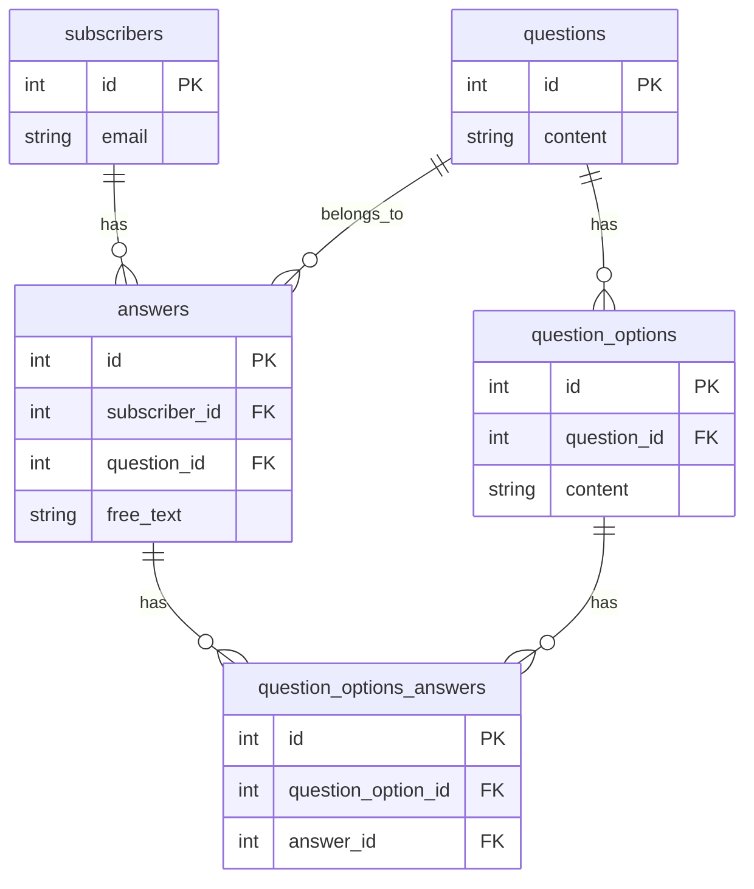

```mermaid
erDiagram
    subscribers {
        int id PK
        string email
    }
    
    questions {
        int id PK
        string content
    }
    
    question_options {
        int id PK
        int question_id FK
        string content
    }
    
    answers {
        int id PK
        int subscriber_id FK
        int question_id FK
        string free_text
    }
    
    question_options_answers {
        int id PK
        int question_option_id FK
        int answer_id FK
    }

    subscribers ||--o{ answers : "has"
    questions ||--o{ answers : "belongs_to"
    questions ||--o{ question_options : "has"
    question_options ||--o{ question_options_answers : "has"
    answers ||--o{ question_options_answers : "has"
```
